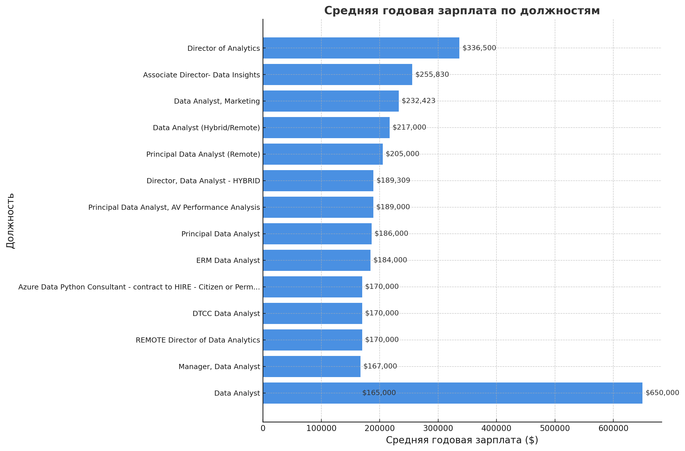

# Введение
📊 Изучаем рынок всех вакансий в сфере работы с данными. Фокусируемся на вакансии **аналитика данных**. Этот проект ищет самые 💰 высокооплачиваемые работы, 🔥 самые востребованные навыки, а так же 🎯 высокооплачиваемые навыки в связи с количеством открытых вакансий!

🔍 Мои SQL-запросы в этой папке: [project_sql](/sql_project/)

# Исходная информация

Стремление более эффективно ориентироваться на рынке вакансий для аналитиков данных послужило толчком к созданию этого проекта, чтобы упростить для других поиск оптимальных рабочих мест.

Данные взяты из [курса по SQL by Luke Barousse](https://www.lukebarousse.com/sql). Они содержат информацию о должностях, зарплатах **(💲 В долларах США 💲)**, местоположении и ключевых навыках.

❤️ Спасибо большое автору этого курса! ❤️

## Вопросы, на которые я хотел ответить с помощью SQL-запросов:

    1. Какие вакансии аналитиков данных являются самыми высокооплачиваемыми?

    2. Какие навыки требуются для этих высокооплачиваемых должностей?

    3. Какие навыки наиболее востребованы для аналитиков данных?

    4. Какие навыки ассоциируются с более высокими зарплатами?

    5. Какие навыки являются наиболее оптимальными для изучения?

# Инструменты, которые я использовал

Для моего глубокого анализа рынка вакансий аналитиков данных я использовал несколько ключевых инструментов:

- SQL: Основа моего анализа, позволивший мне делать запросы к базе данных и находить ключевые инсайты.
- PostgreSQL: Выбранная система управления базами данных, идеально подходящая для работы с данными о вакансиях.
- Visual Studio Code: Моя основная среда для управления базами данных и выполнения SQL-запросов.
- Git & GitHub: Необходимы для контроля версий и обмена моими SQL-скриптами и анализом, что обеспечивает совместную работу и отслеживание прогресса проекта.

# Анализ

Каждый запрос в этом проекте был нацелен на исследование конкретных аспектов рынка вакансий для аналитиков данных. Вот как я подошёл к каждому вопросу:

### 1. Самые высокооплачиваемые вакансии аналитика данных
 Чтобы определить самые высокооплачиваемые должности, я отфильтровал вакансии для аналитиков данных по средней годовой зарплате, сфокусировавшись на удалённых работах. Этот запрос выявляет самые высокооплачиваемые удалённые вакансии в этой сфере.

```sql
SELECT 
    job_id,
    company_id,
    job_title,
    ROUND(salary_year_avg, 0) AS salary_year_avg
FROM job_postings_fact
WHERE 
    job_title_short = 'Data Analyst'
    AND job_location = 'Anywhere'
    AND salary_year_avg IS NOT NULL
ORDER BY salary_year_avg DESC
LIMIT 15;
```

- **Самые высокие зарплаты предлагают для руководящих должностей**, таких как Director of Analytics и Associate Director- Data Insights. Уровни должностей. Зарплаты четко зависят от уровня должности. Заработная плата Director выше, чем у Principal, а Principal, в свою очередь, получают больше, чем обычные Data Analyst.

- После исключения выброса 650 000 (первая строка), **самые высокие зарплаты для аналитиков колеблются от 165 000 до 336 500 долларов в год**. Аномалия в 650 K выглядит либо ошибкой данных, либо очень редкой позицией (например, в крупной корпорации с бонусами/акциями).



### 2. Самые высокооплачиваемые навыки для аналитика данных
Для выявления наиболее высокооплачиваемых навыков я выбрал список из топ-15 самых высокооплачиваемых вакансий дата-аналитика (удалёнка), где для каждой вакансии указаны компания, должность, зарплата и требуемые навыки.

```sql
WITH top_paying_jobs AS (
    SELECT 
        job_id,
        name AS company_name,
        job_title,
        salary_year_avg
    FROM job_postings_fact
    LEFT JOIN company_dim 
        USING (company_id)
    WHERE 
        job_title_short = 'Data Analyst'
        AND job_location = 'Anywhere'
        AND salary_year_avg IS NOT NULL
    ORDER BY salary_year_avg DESC
    LIMIT 15
)

SELECT 
    top_paying_jobs.*,
    skills
FROM top_paying_jobs
INNER JOIN skills_job_dim 
    USING (job_id)
INNER JOIN skills_dim 
    USING (skill_id)
ORDER BY salary_year_avg DESC;
```

В самых высокооплачиваемых вакансиях чаще всего упоминаются следующие навыки:
- Python: 16 упоминаний
- SQL: 12 упоминаний
- Azure: 10 упоминаний
- AWS: 9 упоминаний
- Tableau: 8 упоминаний
Это говорит о том, что навыки в области программирования (Python, SQL) и работы с облачными платформами (Azure, AWS) являются наиболее востребованными среди высокооплачиваемых должностей.


### 3. Самые востребованные навыки для аналитиков данных
Для ответа на этот вопрос нужно было получить таблицу из 5 навыков, которые чаще всего встречаются в вакансиях "Data Analyst", и количество вакансий для каждого навыка.

```sql
SELECT 
    skills,
    COUNT(job_id) AS demand_count
FROM job_postings_fact
INNER JOIN skills_job_dim 
    USING (job_id)
INNER JOIN skills_dim 
    USING (skill_id)
WHERE 
    job_title_short = 'Data Analyst'
GROUP BY skills
ORDER BY demand_count DESC
LIMIT 5;
```
Предоставленные данные показывают количество упоминаний каждого навыка, что является прямым показателем их востребованности на рынке труда.

| Навык       | Количество упоминаний |
| ----------- | ----------------------|
| sql         | 92628                 |
| excel       | 67031                 |
| python      | 57326                 |
| tableau     | 46554                 |
| power bi    | 39468                 |

Основа основ:
Навыки работы с базами данных (SQL) и электронными таблицами (Excel) остаются фундаментальными и самыми востребованными на рынке труда.

Навыки в области программирования (Python) и инструменты бизнес-аналитики (Tableau, Power BI) являются следующим уровнем востребованности, что отражает растущий спрос на специалистов, способных работать как с сырыми данными, так и создавать наглядные дашборды и отчеты.

Наиболее ценными являются специалисты, которые обладают комбинацией этих навыков. Например, специалист, который умеет извлекать данные с помощью SQL, анализировать их с помощью Python и визуализировать результаты в Power BI, будет иметь значительное преимущество на рынке труда.

### 4. Навыки/высокая зарплата

Чтобы найти навыки, ассоциированные с более высокими зарплатами я выбрал топ-20 навыков, которые чаще всего встречаются в вакансиях аналитика данных, отсортированных по средней зарплате, с указанием средней зарплаты и количества вакансий для каждого навыка.

```sql
SELECT 
    skills AS skill,
    ROUND(AVG(salary_year_avg), 0) AS avg_salary_per_skill,
    COUNT(skills) AS quantity_of_vacancies
FROM job_postings_fact
INNER JOIN skills_job_dim 
    USING (job_id)
INNER JOIN skills_dim 
    USING (skill_id)
WHERE 
    job_title_short = 'Data Analyst'
    AND salary_year_avg IS NOT NULL
GROUP BY skills
ORDER BY avg_salary_per_skill DESC
LIMIT 20;
```

| Навык        | Средняя зарплата за навык | Количество вакансий |
|--------------|----------------------|------------------------|
| svn          | 400000               | 1                      |
| solidity     | 179000               | 1                      |
| couchbase    | 160515               | 1                      |
| datarobot    | 155486               | 1                      |
| golang       | 155000               | 2                      |
| mxnet        | 149000               | 2                      |
| dplyr        | 147633               | 3                      |
| vmware       | 147500               | 1                      |
| terraform    | 146734               | 3                      |
| twilio       | 138500               | 2                      |
| gitlab       | 134126               | 7                      |
| kafka        | 129999               | 40                     |
| puppet       | 129820               | 2                      |
| keras        | 127013               | 3                      |
| pytorch      | 125226               | 20                     |
| perl         | 124686               | 20                     |
| ansible      | 124370               | 2                      |
| hugging face | 123950               | 2                      |
| tensorflow   | 120647               | 24                     |
| cassandra    | 118407               | 11                     |

Навыки svn и solidity имеют самые высокие зарплаты, но при этом у них всего по одной вакансии, что может указывать на узкоспециализированные или нишевые должности.
С другой стороны, такие навыки, как Kafka, Pytorch и Perl, имеют более низкую среднюю зарплату по сравнению с лидерами списка, но при этом обладают значительно более высоким спросом.

### 5. Наиболее оптимальные навыки для изучения
Для определения оптимальных навыков для изучения мною был сделан запрос который выбирает 25 наиболее востребованных навыков с самой высокой средней зарплатой, где спрос на навык больше 9 вакансий.

```sql
WITH skills_demand AS (
    SELECT 
        skill_id,
        skills AS skill,
        COUNT(job_id) AS demand_count
    FROM job_postings_fact
    INNER JOIN skills_job_dim 
        USING (job_id)
    INNER JOIN skills_dim 
        USING (skill_id)
    WHERE 
        job_title_short = 'Data Analyst'
    GROUP BY 
        skill_id, 
        skills
), 
average_salary AS (
    SELECT 
        skill_id,
        skills AS skill,
        ROUND(AVG(salary_year_avg), 0) AS avg_salary_per_skill
    FROM job_postings_fact
    INNER JOIN skills_job_dim 
        USING (job_id)
    INNER JOIN skills_dim 
        USING (skill_id)
    WHERE 
        job_title_short = 'Data Analyst'
        AND salary_year_avg IS NOT NULL
    GROUP BY 
        skill_id, 
        skills
)

SELECT 
    skills_demand.skill_id,
    skills_demand.skill,
    demand_count,
    avg_salary_per_skill
FROM skills_demand
INNER JOIN average_salary 
    USING (skill_id)
WHERE 
    demand_count > 9
ORDER BY 
    avg_salary_per_skill DESC,
    demand_count DESC
LIMIT 25;
```
| Skill ID | Навык        | Количество вакансий | Средняя зарплата за навык |
|----------|--------------|--------------|-----------------------|
| 224      | svn          | 58           | 400000               |
| 38       | solidity     | 50           | 179000               |
| 65       | couchbase    | 22           | 160515               |
| 206      | datarobot    | 41           | 155486               |
| 27       | golang       | 79           | 155000               |
| 109      | mxnet        | 20           | 149000               |
| 119      | dplyr        | 94           | 147633               |
| 73       | vmware       | 184          | 147500               |
| 212      | terraform    | 270          | 146734               |
| 250      | twilio       | 30           | 138500               |
| 220      | gitlab       | 514          | 134126               |
| 98       | kafka        | 1205         | 129999               |
| 222      | puppet       | 40           | 129820               |
| 100      | keras        | 210          | 127013               |
| 101      | pytorch      | 486          | 125226               |
| 31       | perl         | 578          | 124686               |
| 223      | ansible      | 186          | 124370               |
| 121      | hugging face | 11           | 123950               |
| 99       | tensorflow   | 772          | 120647               |
| 63       | cassandra    | 321          | 118407               |
| 238      | notion       | 382          | 118092               |
| 219      | atlassian    | 337          | 117966               |
| 218      | bitbucket    | 338          | 116712               |
| 96       | airflow      | 2012         | 116387               |
| 3        | scala        | 1864         | 115480               |

**Выводы и рекомендации**

🔥 Для карьеры «широкого спроса»:

Если цель – много вакансий, выбирайте:

- Airflow, Scala, Kafka, TensorFlow, Terraform, - GitLab.
Это технологии для Data Engineering, ML и DevOps.

💎 Для карьерных «премиум-ниш»:

Если приоритет – максимальная зарплата, но меньше предложений:

- Solidity (блокчейн/смарт-контракты).

- Golang (backend/системное ПО).

- Couchbase, DataRobot (ML-платформы/NoSQL).

Золотая середина (хороший баланс):

- Kafka — лидер по сочетанию спроса и зарплаты (~130k при 1200+ вакансий).

- GitLab — частая технология DevOps с хорошей оплатой (~134k).

- Pytorch и TensorFlow — топ для ML/AI (125–120k при высоком спросе).

Редкие навыки дают рекордные зарплаты, но вакансий мало → риск ограниченного рынка.

Инфраструктурные технологии (Airflow, Terraform, GitLab) обеспечивают устойчивый спрос, пусть и со средним уровнем зарплаты.

ML/AI фреймворки (Kafka, TensorFlow, Pytorch) — оптимальный выбор для будущего роста.

# Что я изучил
- **Создание сложных запросов:** Освоил искусство написания продвинутых SQL-запросов, научился объединять таблицы как профессионал и виртуозно использовать оператор WITH для работы с временными таблицами.

- 🔓 **Освоил новые инструменты:** PostgreSQL, Visual Studio Code, Git & GitHub и немного pandas. Этот стек технологий позволил мне построить целостный и профессиональный процесс работы с данными — от написания кода до представления результатов.

- 📊 **Аналитическая магия:** Прокачал навыки решения практических задач, научившись преобразовывать вопросы в эффективные и содержательные SQL-запросы.

# Выводы:
На основе проведённого анализа рынка вакансий аналитиков данных можно выделить несколько ключевых тенденций и практических рекомендаций:

**Уровень должности напрямую влияет на зарплату**

Самые высокие доходы получают руководители (Director of Analytics, Associate Director), за ними следуют Principal Data Analyst, и только затем – рядовые Data Analyst.

Диапазон высоких зарплат для удалённых позиций стабильно держится на уровне 165–336 тыс. долларов в год.

**Фундаментальные навыки остаются обязательными**

Базовые компетенции – SQL, Excel, Python, а также инструменты визуализации (Tableau, Power BI) – неизменно лидируют по спросу.

Владение этой комбинацией навыков формирует прочный фундамент и открывает путь к большинству вакансий.

**Высокие зарплаты концентрируются в нишевых и технологических навыках**

Наиболее высокооплачиваемые навыки, такие как SVN, Solidity, Couchbase, DataRobot, демонстрируют редкое сочетание высокой стоимости и низкой распространенности.

Это свидетельствует о том, что уникальные компетенции могут приносить премиальные доходы, но рынок таких вакансий ограничен.

Оптимальный баланс спроса и дохода дают инфраструктурные и ML-технологии

Kafka, GitLab, Terraform, Airflow, а также фреймворки машинного обучения (TensorFlow, PyTorch) сочетают высокий спрос и достойный уровень зарплаты (120–135 тыс. долларов).

Эти навыки особенно перспективны для долгосрочной карьеры в Data Engineering, ML/AI и DevOps.

**Стратегия карьерного развития**

Для стабильного спроса и широких возможностей: развивайте Airflow, Scala, Kafka, Terraform, GitLab.

Для максимизации дохода в узкой нише: изучайте Solidity, Golang, Couchbase, DataRobot.

Для роста в перспективных отраслях (ML/AI): делайте ставку на PyTorch и TensorFlow.

# Заключительные мысли

Этот проект стал для меня не только возможностью глубже понять рынок вакансий в сфере аналитики данных, но и настоящей практической тренировкой. Работая над анализом, я опробовал в бою SQL, а также научился строить сложные запросы с использованием WITH, объединять таблицы, эффективно фильтровать данные и превращать сырые цифры в осмысленные инсайты, сделал первые шаги в визуализации данных и подготовке материалов в удобном формате.

Отдельная благодарность автору курса [Luke Barousse](https://www.youtube.com/@LukeBarousse) за качественный бесплатный материал и вдохновляющий подход к обучению. Его курс стал отличной отправной точкой, дав не только теорию, но и реальные задачи. Впервые я познакомился с ним в курсе по Excel для анализа.

На данном этапе мой главный фокус смещается на дальнейшее углубление hard-навыков: изучение продвинутых инструментов анализа данных, освоение новых технологий. Следующий шаг – создание практических проектов, которые помогут не только закрепить полученные знания, но и сформировать портфолио, демонстрирующее умение решать реальные бизнес-задачи.

Этот проект стал для меня доказательством того, что системный подход, постоянная практика и любопытство открывают путь к новым профессиональным горизонтам.